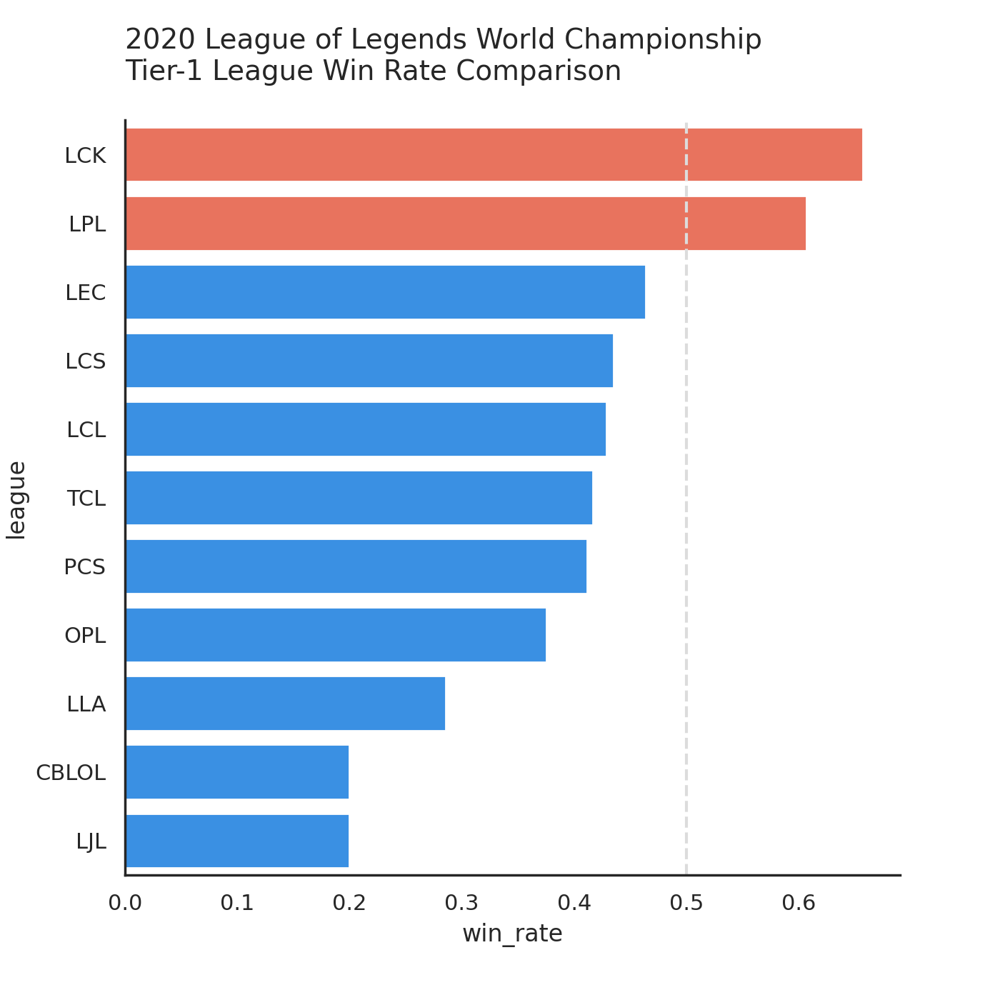
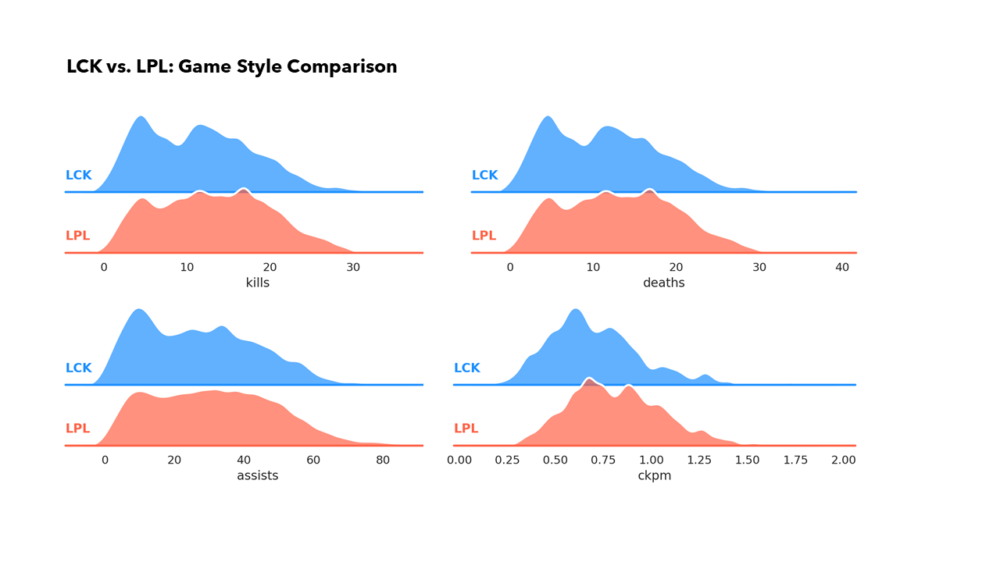
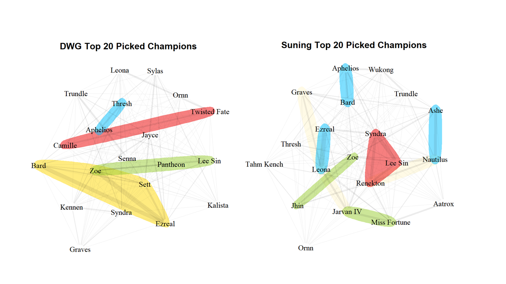
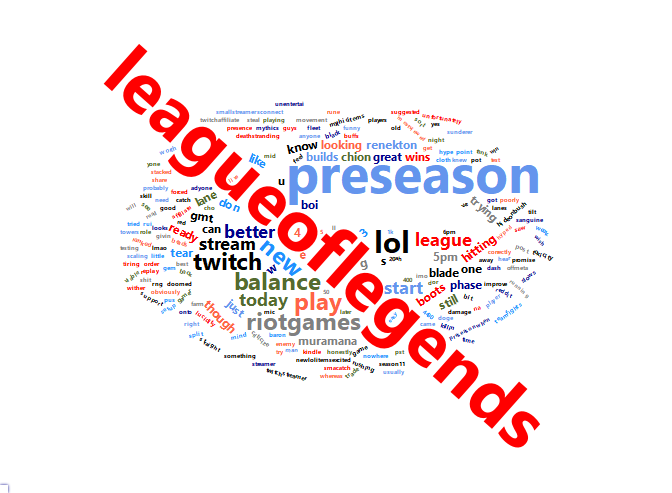

```{r setup, include=FALSE}
library(flexdashboard)

library(ggplot2)
theme_set(theme_bw())
library(ggmap)
library(tidyverse)
library(sf)
library(rnaturalearth)
library(rnaturalearthdata)

library(extrafont)
# font_import(pattern="[T/t]imes")
# loadfonts(device="win")

library(wordcloud)
library(wordcloud2)
```

### Welcome to the Summoner's Rift: League of Legends Basics Explained

```{r fig.cap="A caption", out.width = '100%'}
knitr::include_graphics("./anly-503-final-project/cover1.png")
```

*** 

League of Legends is one of the most popular team-based action-strategy game developed and published by Riot Games. 

The idea is simple - two five-player teams play against each other and the one that first take down the other's base claims victory. Tons of decisions need to be made on battling, resource seizing, etc., and there are over a hundred characters (called 'champions') with distinct abilities can be chosen from, which make the game even more complex.

The map of a League of Legends game consists of Top, Middle, Bottom Lane, and Jungle. Five players from each team would choose which position they play at, usually 1 for Top, 1 for Mid, 1 for Jungle and 2 players go to the bottom.


### An Esport Sweeping the World: 12 Leagues around the World

```{r fig.cap="A caption", out.width = '100%'}


knitr::include_graphics("./anly-503-final-project/league_map.png")
```

*** 

Twelve tier-1 professional leagues of League of Legends Esports and the regions/countries they represent are as the following:

* League of Legends Champions Korea (LCK): South Korea
* League of Legends Pro League(LPL): Mainland China
* League of Legends European Championship (LEC): Europe
* League of Legends Championship Series (LCS): United States, Canada
* Pacific Championship Series (PCS): Taiwan, Hong Kong, Macao, Southeast Asia
* Campeonato Brasileiro de League of Legends (CBLOL): Brazil
* League of Legends Continental League (LCL): Russia
* League of Legends Japan League (LJL): Japan
* Liga Latinoamérica (LLA): Latin America
* Oceanic Pro League (OPL): Australia
* Vietnam Championship Series (VCS): Vietnam


### Which is the strongest league out of the twelve?

```{r fig.width=6, fig.height=6}

```

***

The graph compares the win rates of the 12 leagues in the 2020 League of Legends World Championship.

LCK (South Korea) is ranked top one, followed by LPL (Mainland China). Both have a over 60% win rate. 


### League Game Style: Conflict-Averse LCK vs. Risk-Seeking LPL

```{r}

```

***

Let's compare the kills, deaths, assists, and ckpm (combined kills per minute) for all domestic games of LCK (South Korea) and LPL (Mainland China):

* While the distributions are mainly overlapped, we can observe that those of LCK are more right-skewed, indicating a slightly more conflict-averse game style

* It becomes clearer when looking ckpm (sum of kills and deaths per min), a metric used to measure team aggressiveness - LPL has a higher ckpm, 0.82 on average, compared with 0.71 for LCK.


### Top 2 Team Game Style over Time

```{r}
knitr::include_graphics("./anly-503-final-project/game_style_over_time.png")
```

***

I picked the Top 2 teams from the 2020 World Championship, Damwon Gaming (LCK) and Suning (LPL), and compare their game style over time.

For the two graphs, blue represents DWG and red represents Suning. We can see that:

* DWG generally focuses more on creep score (giviing minions the last hit to earn gold) than confronting the enemies.
* Over the time, Suning plays more aggressively while DWG becomes more cautious.


### Compare Champion Picks: More Variations from Suning Gaming

```{r}

```

***

Now let's talk about champion picks!

The two networks demonstrate Suning and DWG's top 20 picked champions in 2020 and how those champions are connected with each other (be in the same game). The thicker an edge, the more frequently the pair of champions be in the same game. I highlighted the most salient connections (red: mid to top, green: mid to bottom, blue: bottom and support, beige: others). We can have the following observations:

* Most frequently picked combinations for DWG: Sett-Zoe-Ezreal-Bard
* It seems that Suning has more variations in building the teams


### Bye Bye Season 2020, See You in 2021!

```{r fig.width = 7, fig.height=7}



```


***

Now the League of Legends Season 10 has ended and the new season is right around the corner, I collected the last 7-day tweets with hashtags #leagueoflegends and #preseason and created this word cloud. 

Looking forward to the new season and more games:)